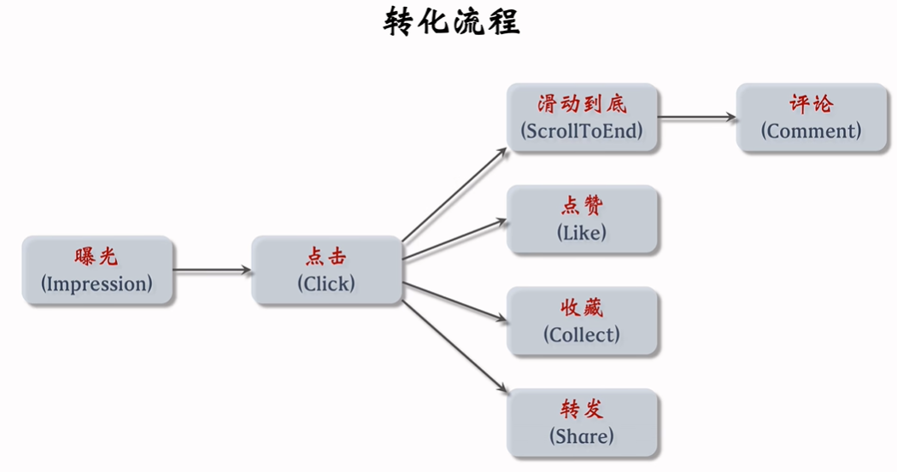
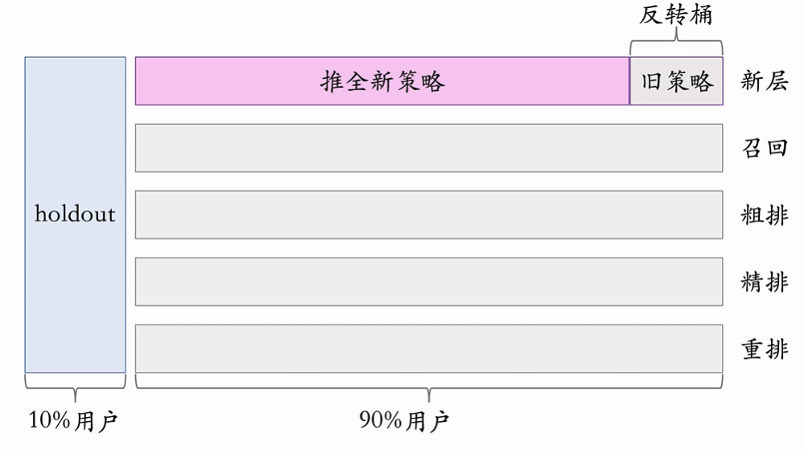

# 推荐系统基础

## 基本概念

以小红书为例，推荐的转化流程如下，先在用户主页获得曝光，用户点击后产生的后续操作可以作为推荐的指标。

推荐系统注重的**短期消费指标**可以分为以下几个：

- 点击率：点击次数/曝光次数
  - 一篇笔记曝光给100个用户，有20个用户点击了，则点击率为20%
  - `点击率越高，说明推荐越精准`
- 点赞率：点赞次数/点击次数
- 收藏率：收藏次数/点击次数
- 转发率：转发次数/点击次数
- 阅读完成率：滑动到底次数/点击次数*f(笔记长度)
  - f(.)是一个归一化函数

衡量推荐系统的好坏，最重要的指标是**北极星指标**：

- 用户规模：日活用户数(DAU)，月活用户数(MAU)
  - 一天中使用了app的用户数量，一个月中使用了app的用户数量
- 消费：人均使用推荐的时长，人均阅读笔记的数量
- 发布：发布渗透率，人均发布量

## 链路

- 召回：从小红书所有笔记中获取几千篇笔记
- 粗排：用机器学习模型给几千篇笔记打分，并选取高分的几百篇笔记
- 精排：用大规模深度神经网络给几百篇笔记打分
- 重排：根据精排分数和多样性分数随机抽样几十篇笔记，用规则把相似内容打散，插入广告和运营内容

## AB测试

在有了一个新的推荐算法后，需要小流量上线观察效果，也需要调参观察参数对指标的影响。

- 随机分桶：把用户随机分成b个桶，每个桶有等量的用户。每个桶采取不同的策略，不同的参数，以及一个空白对照桶，用来观察算法对业务指标的影响。
- 分层实验：对于推荐链路的不同层，召回、粗排、精排、重排、用户界面、广告等。同一层不同算法测试的用户桶互斥，不能让他们相互干扰；不同层用户桶正交，独立随机划分属于自己层的用户桶，不同层的策略效果通常不会相互干扰，因此即使作用到同一个用户身上，指标仍然是有效的。
- Holdout：除了实验桶，会留10%的用户作为holdout，不做任何策略。这样用来对比其它策略的累计效果，从而计算绩效。

小流量阶段，某个桶如果效果显著高于对照组，可以将它**推全**，即应用到所有90%用户中。

**反转实验**：有的指标很快会受到新策略的影响，而有的需要长时间观察。因此可以在推全的新层开一个反转桶，在其中用旧策略，对比观测新策略的长期效果。当holdout计算结束，可以将剩余10%推全，反转桶不受影响。当反转实验结束，达到真正的推全。

