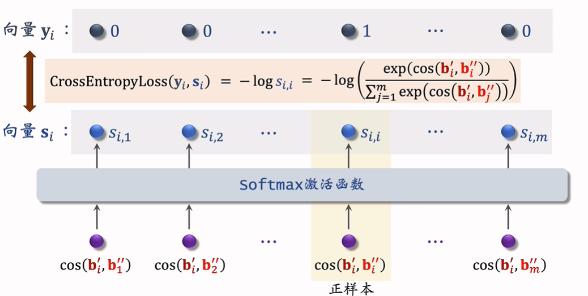

# 召回

召回的目的是筛选出一批item推荐给特定用户，有不同的召回通道可以应用不同的策略。

## 一、基于物品的协同过滤(ItemCF)

如下图，对于每个物品，会计算用户的兴趣值（点赞加一分，评论加一分等）。对于判断是否推荐给用户的物品，会计算其与用户相关物品的相似度。用兴趣值乘以相似度，计算求和，就可以**预估用户对新物品的兴趣**。即$2*0.1+1*0.4+4*0.2+3*0.6$

### 计算物品相似度

如果两个物品的受众重合度很高，则相似。

记喜欢物品$i1$的用户集合$W1$，喜欢物品$i2$的用户集合$W2$，$V=W1\cap W2$,则相似度（取值在0~1）计算如下：
$$
sim(i1,i2)=\frac{|V|}{\sqrt{|W1|\cdot|W2|}}
$$
考虑**用户喜欢物品的程度**，新的相似度计算如下：
$$
sim(i1,i2)=\frac{\sum_{v\in V}like(v,i1)\cdot like(v,i2)}{\sqrt{\sum_{u1\in W1}like^2(u1,i1)}\cdot \sqrt{\sum_{u2\in W2}like^2(u2,i2)}}
$$

> 上述公式实际上就是两个向量i1和i2的遇险相似度，每个向量的元素值就是对应用户的喜欢程度。V之外的用户在对方物品的向量值是0，因此分子只有|V|个用户累加。

### ItemCF召回流程

**离线计算**

- 建立用户到物品的索引，对每个用户，构建一个感兴趣物品列表：u1->[i1:like1,i2:like2,...]
- 建立物品到物品索引，计算两两物品相似度，对每个物品，索引最近的k个物品：i1->[i2:sim2,i3:sim3,...]

**线上召回**

- 返回用户最感兴趣的n个物品->last-n
- 对last-n中每个物品，找到与它最相近的k个物品，最多共nk个
- 对这nk个物品，用公式预估用户对每个物品的兴趣分数
- 返回分数最高的100个推荐给用户

ItemCF是一个召回通道，还会有其它的召回通道。

## 二、Swing模型

——ItemCF的改进。

假如重合的用户是一个**小圈子**内的，即V中的用户在一个微信群内，分享到群内的帖子（item）他们都会关注，但并不代表群内所有item都相似度很高。

Swing模型会给用户设置权重，解决小圈子的问题。

记用户u1喜欢的物品集合为J1，u2喜欢的为J2。定义两个用户的重合度：
$$
overlap(u1,u2)=|J1\cap J2|
$$
如果用户u1和u2的重合度高，代表他们可能来自同一个小圈子，应该降低他们的权重。

> 可以理解为，饭圈中的喜欢具有传播效应，其对真实明星价值的反映需要打折扣。

那么新的相似度计算如下：
$$
sim(i1,i2)=\sum_{u1\in V}\sum_{u2\in V}\frac{1}{\alpha+overlap(u1,u2)}
$$
$\alpha$是超参数，对于公共喜欢i1和i2的用户集合V，若里面有两个人来自小圈子，overlap越大，权重越低。

## 三、基于用户的协同过滤(UserCF)

如下图，对每个用户，计算用户之间的相似度。对每个可能推荐给目标用户的物品，计算相似用户对该物品的兴趣，累计相似度与兴趣的乘积。

### 计算用户相似度

如果两个用户喜欢的物品重合度很高，即相似。

用户u1喜欢的物品集合为J1，u2喜欢的为J2，$I=J1\cap J2$. 则两个用户的相似度定义为：
$$
sim(u1,u2)=\frac{|I|}{\sqrt{|J1|\cdot |J2|}}
$$
考虑到不同物品的热门程度，越热门的物品，其反映用户喜好的功能性越差，应该降低它的权重：
$$
sim(u1,u2)=\frac{\sum_{l\in I}\frac{1}{log(1+n_l)}}{\sqrt{|J1|\cdot |J2|}}
$$
$n_l$表示喜欢物品l的用户数量，其值越大代表物品越热门，该物品的权重越低。

### ItemCF召回流程

**离线计算**

- 建立用户到物品的索引，对每个用户，构建一个感兴趣物品列表：u1->[i1:like1,i2:like2,...]
- 建立用户到用户索引，计算两两相似度，对每个用户，索引最相似的k个用户：u1->[u2:sim2,u3:sim3,...]

**线上召回**

- 找到和用户最相似的k个用户
- 对每个top-k用户，找到其近期感兴趣的物品列表 -> last-n
- 对于召回的nk个相似物品，计算用户对物品的兴趣分数
- 返回分数最高的100个推荐给用户

## 四、特征离散处理

性别、国籍、英文单词、物品id、用户id等都是离散特征。其处理按照以下步骤：

- 建立字典：把国际等类别映射成序号 -> 中国:1,美国:2
- 向量化：把序号映射成向量
  - one-hot编码：高维稀疏向量；类别数量太大时，不用one-hot编码
  - embedding：低维稠密向量

### embedding

embedding层的参数量：向量的维度*类别数量

假设有100个国家，每个embedding是4维，则embedding层的参数是4*100.列j代表100个国家中第j个国家的向量表示。

如下图，embedding的得到可以理解为参数矩阵和one-hot向量的乘积：

## 五、矩阵补充模型

如下图，用两个不共享参数的embedding层提取用户和物品的embedding，计算两者的内积，表示用户喜欢该物品的程度。这种方法能计算任意一个用户和物品的匹配程度（哪怕没有曝光给用户的物品），对原始的用户-物品矩阵进行了补充。

### **训练**

训练的目的是让提取出来的embedding经过内积计算能更好地反映真实的相似度。

- 数据集：(用户id，物品id，兴趣分数)的集合，记作$\Omega=\{(u,i,y)\}$. 其中分数y是系统记录的，比如点击、点赞、转发、收藏各算一分的累加。

- 优化：训练embedding层的优化目标如下：
  $$
  min_{A,B}\sum_{(u,i,y)\in \Omega}(y-\langle a_u,b_i\rangle)^2
  $$
  其中AB代表两个embedding矩阵的参数，$a_u,b_i$代表其中的第u列和第i列。优化方法可以选取随机梯度下降，每次优化一列。

**缺点**

矩阵补充方法在工业界效果并不好，原因如下：

- 仅仅使用ID的信息做embedding，即仅仅用one-hot编码做输入。并没有考虑到用户和物品除类别外额外的信息。
  - 比如用户的性别、年龄、地理位置（可以理解为超类）
- 负样本选取方式不对，用得分为0的样本作为负样本实际上并不合理。
- 训练的方法不好，内积不如余弦相似度，MSE（回归）不如CE loss（分类）

### **模型存储**

- 矩阵A(用户)的每一列作为value，该列的用户id作为key，存储到字典中。
- 矩阵B的存储比较复杂

### **近似最近邻查找(Approximate Nearest Neighbor Search)**

对于用户i，得到他的embedding a后，需要计算它和每个物品embedding的相似度，从而找到k个最相近的物品召回。此方法时间复杂度正比于物品的数量，需要优化。

如下图所示，对于许多item，可以先划分成不同的区域（聚类）,对每个区域求一个代表单位向量。那么当需要计算一个用户的最近k个物品，先比较他和哪个单位向量比较相近，再到该单位向量的区域中查找最近的k个物品。

- 划分的存储方法：以单位向量为key，区域内embedding为list存储。
- 划分的形式：如果相似度计算是余弦相似度，则扇形划分；如果是欧氏距离，则多边形划分。

## 六、双塔模型

双塔模型是矩阵补充模型的升级，考虑到了除id之外的特征。如下图，对每个离散特征（包括id），用一个独立的embedding层提取embedding。对连续特征，做归一化、分桶等处理。将特征的embedding连接到一起后输入神经网络，得到最终的表征。

物品的表征提取也是这样，这两个NN构成双塔模型。用余弦相似度对比两个特征的距离。

> 召回的双塔模型，**用户和物品的特征最后做相似度匹配**，可以用最近邻算法召回物品。
>
> 排序的模型则可以把用户和物品的特征连接，再输出分数。但这样需要每个特征都求出来连接好，无法应用最近邻算法。

### 训练

**正负样本的选择**

- 正样本：用户点击的物品
  - 问题：点击高的往往是同样一批热门物品，不一定能反映用户兴趣。
  - 方案：对热门物品做降采样或者对冷门物品做过采样
- 负样本：没有呗召回的，召回但被粗排精排淘汰的
  - 简单负样本——未被召回的物品：几乎是全部物品，在其中采样出负样本
    - 非均匀采样：要在负样本中采样一些热门物品，用来打压热门物品。
    - 负样本采样概率：$\propto (点击次数)^{0.75}$. 物品越热门，越有可能被采样到负样本中。
  - 简单负样本——batch内负样本：一个batch中有n个user-item正样本对，那么u1和i2-in可看作负样本对，共有n(n-1)个。
    - 此时负样本的采样概率 $\propto (点击次数)^{1}$, 对正样本打压太狠了。
    - 方案：在训练的时候将$cos(a,b^-)$换成$cos(a,b^-)-log_{p_i}$,$p_i$表示采样概率，按上面说的就是1. 线上召回计算cos的时候无需修改，此修改只是为了训练时纠偏。
  - 困难负样本——粗排精排淘汰的样本：它们本就和用户兴趣比较相关，因此分类更加困难。
  - 非负样本——曝光但为点击的样本：此类样本不能作为召回模型的负样本，召回模型只需要快速选出可能感兴趣的，不需要精确到点击的程度。

**Pointwise训练——二分类任务**

- 正样本，鼓励cos(a,b)接近+1
- 负样本，鼓励cos(a,b)接近-1
- 控制正负样本的数量为1:2或者1:3（经验数值）

**Pairwise训练**

对每个用户，取一个正样本的item和一个负样本的item，组成三元组$(a,b^+,b^-)$. 其中$b^+,b^-$是同一个模型输出的embedding。

- 鼓励$cos(a,b^+)$大于$cos(a,b^-)$
- Triplet hinge loss: $L(a,b^+,b^-)=max\{0,cos(a,b^-)-cos(a,b^+)+m\}$
  - 如果和正样本的cos比和负样本的cos大m，则损失为0；否则存在loss
- Triplet logistic loss: $L(a,b^+,b^-)=log(1+exp[\sigma \cdot (cos(a,b^-)-cos(a,b^+))])$
  - $\sigma$是超参数

**Listwise训练**

对每个用户，取一个正样本的item和n个负样本的item，组成list$(a,b_1^+,...,b_n^-)$. 

- 鼓励$cos(a,b^+)$大，$cos(a,b^-)$小

- 如下图用交叉熵做分类预估，希望softmax输出的正样本分数尽可能大。

  

### 线上服务、模型更新

训练好双塔模型后，用物品塔计算每个物品的特征向量b，存储到向量数据库。向量数据库会自动建立索引（划分向量区域），加速最近邻查找。

对于每个有推荐请求的用户，线上实时计算他的用户向量a，到物品数据库中找到最近的k个物品。

> 物品的特征相对稳定，短期内不太会变化。而用户的兴趣是动态变化的，全部计算存储并不方便。

**全量更新**

今天凌晨，用昨天一整天的数据更新。

- 模型参数：用昨天的数据，在昨天模型参数的基础上训练一个epoch
- 发布：把新的双塔模型发布，重新计算物品向量存入数据库

全量更新对数据流的实时性，对系统的要求比较低。

**增量更新**

一天中用户的兴趣可能会实时变化，需要在几个小时内快速反应。做online learning。

- 实时收集线上数据，做流式处理，生成TFRecord文件

- 模型参数：online learning，只增量更新模型**embedding层**的参数
- 发布：发布新的双塔模型，重新计算物品向量和用户向量

通常来说，全量更新和增量更新都会采用。每天凌晨做昨天一天的全量更新，在当天内做实时的增量更新，如下图。需要注意的是，全量更新基于的是没有增量更新的模型参数，即蓝色更新部分。

> 增量更新是按照早晚时间顺序做训练，它是有偏的。
>
> 全量更新会把数据随机打乱再训练。

## 七、自监督学习改进双塔模型

推荐系统的头部效应很严重，大部分物品点击次数不高，少部分物品占大部分点击。这符合长尾分布，做data augmentation自监督学习，更好地理解**物品**的向量表征。

**数据增强**

- Random Mask：随机选择一些物品的离散特征做mask。
  
  - 比如某物品的类目是数码、摄影，正常会用两个embedding layer得到特征再拼接；mask后直接用default代表类目，经过一个embedding层，得到default的特征。
  
- Dropout：随即丢弃多值离散特征中50%的值。
  
  - 比如上例，丢弃数码或者摄影。
  
- Complementary：对物品的所有特征分为互补的两组，鼓励这两组输出的embedding相似。
  - 比如物品有四种特征：id，类目，关键词，城市。将其随机分为两组，剩余部分用default填充。
  - {id,default,关键词,default}和{default,类目,default,城市},每组输出embedding层拼接，得到两个该物品的embedding，鼓励他们相似。
  
- Mask一组关联的特征：

  - 比如性别{男、女、未知}和类目{美妆、摄影、数码}两个特征，需要判断他们的关联程度。

  - 计算两个特征$U,V$的`互信息`。设$u,v$为$U,V$中的某一个取值，比如男,数码，互信息计算如下：
    $$
    MI(U,V)=\sum_{u\in U}\sum_{v\in V} p(u,v)\cdot log\frac{p(u,v)}{p(u)\cdot p(v)}
    $$
    $p(u)$指某特征取值为u的概率；$p(u,v)$指某特征取值为u同时另一特征取值为v的概率。

  - 离线计算所有特征（k个）两两之间的互信息

  - 每次数据增强选取一个特征作为种子，找到与其最相关的k/2个特征。将他们mask掉，保留剩下的k/2个特征。

  > 优点：效果好。
  >
  > 缺点：实现难度大，不容易维护。

**训练模型**

从全体物品中均匀抽样m个物品，组成一个batch。对这个batch做两种特征变换，物品塔输出两组向量：$b_1',b_2',\cdots,b_m'$和$b_1'',b_2'',\cdots,b_m''$. 第i个物品的损失函数为:
$$
L_{self}[i]=-log(\frac{exp(cos(b_i',b_i''))}{\sum_{j=1}^m exp(cos(b_i',b_j''))})
$$

一个batch的损失即为：
$$
\frac{1}{m}\sum_{i=1}^mL_{self}[i].
$$

## 八、Deep Retrieval召回

双塔模型 —— 用户和物品表征为向量

Deep Retrieval —— 把物品表征为路径，线上查找用户最匹配的路径

### 1.索引

把物品和路径关联起来

- 一个物品可以对应多条路径，如图[2,4,1]和[4,1,1]都表示同一个物品
- 一条路径可以对应多个物品，如图红色路径可能对应多个物品

### 2.预估模型

预估用户对路径的顺序：

给定三个节点表示的路径[a,b,c]，**用户特征x**，用户对路径的兴趣对三个节点条件概率之积：
$$
p(a,b,c|x)=p1(a|x)\times p2(b|a,x)\times p3(c|a,b,x)
$$
$p1,p2,p3$由模型得出。

如下图，$p1,p2,p3$是网络每层的输出结果，取出某个元素值（路径的节点），得到embedding，和x连接再作为下一层的输入。

### 3.线上召回

用户->路径->物品

1. 给定用户特征，用beam search召回一批路径
2. 利用索引 path:[items]召回一批物品
3. 对物品做打分排序，选出一个子集。

**Beam Search**

全部可能的路径是$K^3$，数量级太大。假设beam size是4，流程如下图。

从$p1$的结果中选取最大的4个值，作为路径的起点。在$4\times K$个路径中，选择$p1\times p2$最高的四个路径，得到的L2节点作为新的起点，继续下去...注意需要删除没用到的输入节点，如L1的第7个元素值。

### 4.离线训练

1. 学习神经网络$p(a,b,c|x)$，表示用户对路径的兴趣。
2. 建立双向索引
3. 采样正样本：click(user,item)=1

**学习NN参数**

如果用户点击过某个物品，则该物品的J条路径都认为是感兴趣，希望路径概率的和最大：
$$
loss=-log(\sum_{j=1}^J p(a_j,b_j,c_j|x))
$$
**学习物品表征**

用贪心算法更新，假设物品表征为J条路径，每次选择一条路径$path_l$，用loss+正则项优化更新该路径的值。

- user对path感兴趣程度：$p(path|user)=p(a,b,c|x)$
- item和path的相关性：$score(item,path)=\sum_{user} p(path|user)\times click(user,item)$
  - 即对于一对item和path，获取所有点击过它的user，计算user对该path的感兴趣程度，累加。
- 根据score选择一个物品J条路径$\Pi={path_1,\cdots,path_J}$，损失函数：$loss(item,\Pi)=-log(\sum_{j=1}^Jscore(item,path_j))$
  - 上面的loss有可能导致很多物品都和同一个path关系很大，添加正则项：$reg(path_j)=(number\ of\ items\ on\ path_j)$.

## 九、其它召回通道

### 地理位置召回

仅仅根据用户的地理位置，推荐附近的优质笔记给他，不管是否是他的兴趣。

**GeoHash召回**

- GeoHash：对经纬度的编码，表示地图上一个长方形的区域

- 索引：GeoHash -> 优质笔记列表（按照时间倒排）

**同城召回**

- 索引：城市 -> 优质笔记列表（按照时间倒排）

### 作者召回

- 索引：用户 -> 关注的作者；作者 -> 发布的笔记
- 召回：用户 -> 关注的作者 -> 最新的笔记

### 有交互(但未关注)的作者召回

- 索引：用户 -> 有交互的作者；作者 -> 发布的笔记
- 召回：用户 -> 有交互的作者 -> 最新的笔记

### 相似作者召回

- 索引：作者 -> 相似的作者
  - 相似的计算类似ItemCF
- 召回：用户 -> 感兴趣的作者(n) -> 相似的作者(k) -> 每个作者最新的一篇笔记(nk)

### 缓存召回

精排后的重排过程会随机筛掉一些笔记，这样会造成浪费。

- 精排前50但未曝光的，缓存起来作为一条召回通道
- 当缓存中的笔记被曝光一定次数/被召回一定次数/存在缓存内较长时间，就从缓存中移除

## 十、曝光过滤和Bloom Filter

用户看过某物品，就不再把该物品曝光给用户。

### Bloom Filter

一个用户看过n个物品，本次召回r个物品，暴力的时间复杂度是O(nr). Bloom Filter是一种数据结构，能够用O(1)判断召回的物品是否曝光。凡是被判定为未曝光的则一定未曝光，可以推给用户；被判定为已曝光的则不一定已曝光。

k是一个参数，表示哈希函数的数量。m是二进制向量维度。如下图，k=3，每个物品id用三个哈希函数映射到0~m-1的区间内。

**误判发生的概率**

误判的发生是因为哈希碰撞，记曝光物品集合大小为n，误判概率如下：
$$
\delta \approx (1-exp(-\frac{kn}{m}))^k
$$

- n越大，向量中1越多，误判概率越大
- m越大，哈希碰撞可能越小，但存储空间变多
- k太大、太小都不好，有最优取值
  - 人为设定$\delta$大小，比如0.01，最优参数为：
  - $k=1.44\cdot ln(\frac{1}{\delta})$, $m=2n\cdot ln(\frac{1}{\delta})$

**缺点**

只能添加物品，不能删除物品。而小红书会删除一个月以前曝光的物品，这需要重新计算二进制向量。

