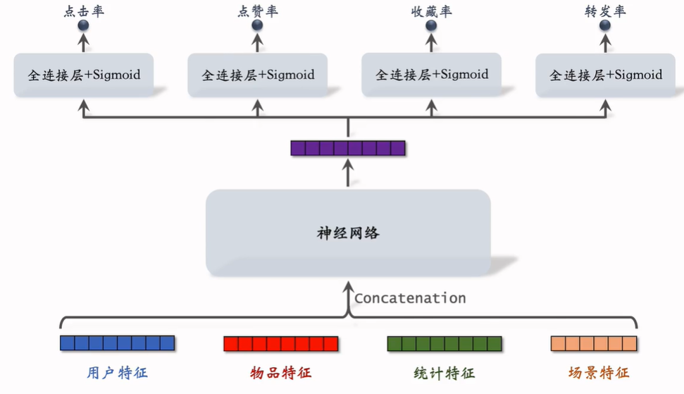
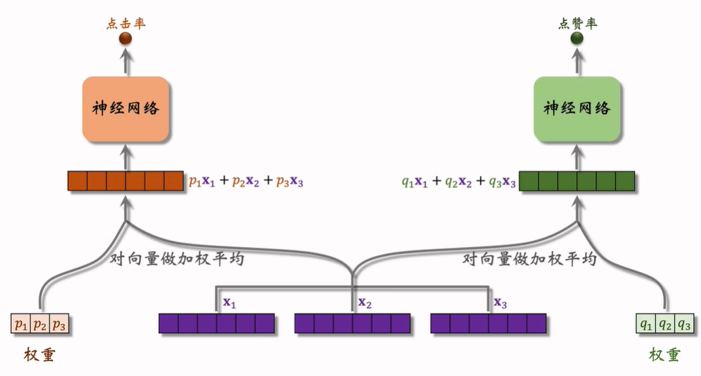
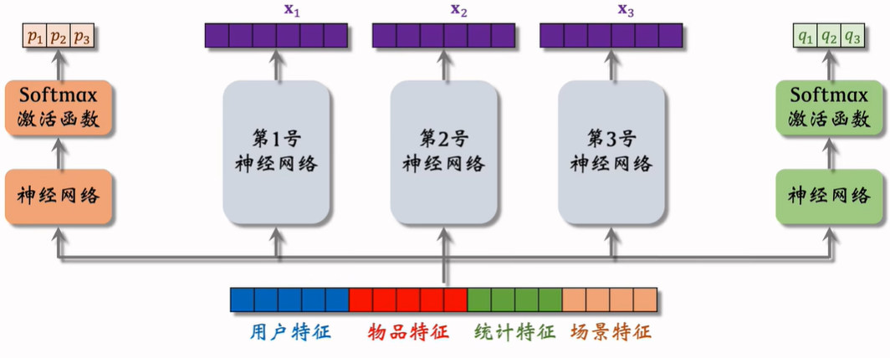
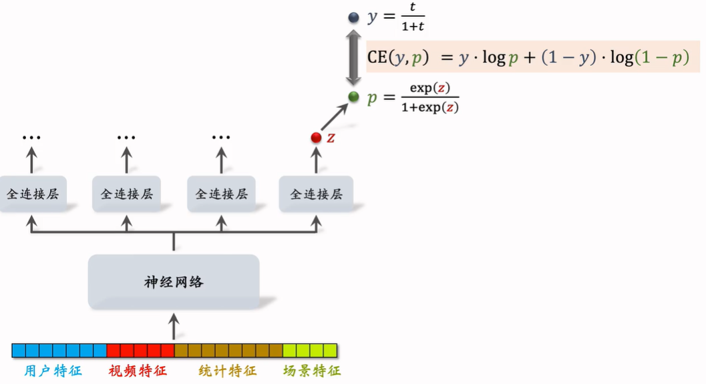
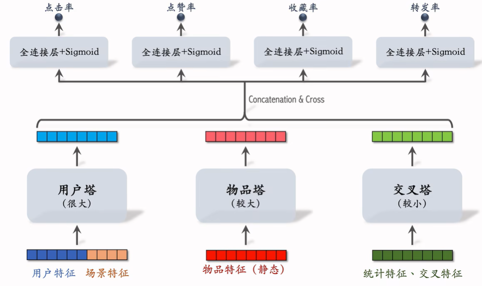

# 排序

对召回的几千篇笔记进行粗排、精排、重排。粗排精排会选出几百篇笔记，重排会筛选几十篇笔记并进行多样化排序展示给用户。粗排精排的原理类似，只是粗排的模型小，相对粗糙。

**排序的依据**

排序模型会预估笔记的点击率、点赞率、收藏率、转发率等多种分数，并进行融合（如加权平均）。根据融合的分数做排序和截断。

## 一、多目标模型

我们想知道某个用户对某个物品的兴趣分数，即点击率等等，用一个多目标的排序模型去预测几个概率。

如下图，将用户的特征、物品特征、统计特征(用户30天内点赞了多少篇笔记等)、场景特征(时间地点等)连接起来输入神经网络，得到的特征分别输入四个小的全连接网络来得到多种分数。

### 训练

记点击率、点赞率、收藏率、转发率的预测分别为$p1,p2,p3,p4$，其真实的点击、点赞、收藏、转发情况为$y1,y2,y3,y4$，计算四个交叉熵损失：
$$
loss=\sum_{i=1}^4 \alpha_i\cdot CEloss(y_i,p_i)
$$

#### 类别不平衡

每一百次曝光，约有10次点击，90次无点击——正负样本不平衡

采用**负样本降采样**的方式，只采样一部分负样本。设采样率为$\alpha$，则负样本数量为$\alpha\cdot n_-$，$n_-$为原本负样本数量。

#### 预估值校准

负样本变少，预估点击率大于真实点击率。

- 真实点击率：$p_{true}=\frac{n_+}{n_++n_-}$
- 预估点击率：$p_{pred}=\frac{n_+}{n_++\alpha\cdot n_-}$
- 校准公式：$p_{true}=\frac{\alpha\cdot p_{pred}}{(1-p_{pred})+\alpha\cdot p_{pred}}$

## 二、MMoE

Multi-gate Mixure-of-Experts

对于连接的特征，输入多个专家网络（下图中3个），得到多个特征向量。此外对于不同的指标预估，设计单独的全连接网络计算多个特征向量的权重（下图中点击率和点赞率两个指标）。对特征向量加权平均后分别输入神经网络，得到指标预估值。

可以把专家神经网络理解为对不同特征的提取，如图像的背景特征和前景特征等。对不同特征的不同加权，可以得到专属于每个指标的预估。

### 极化现象

在训练过程中，softmax输出的权重总倾向于某个值接近1，其余的接近0. 这样相当于只使用了一个专家网络的特征，即用一个专家网络预测一个指标，而失去了融合专家网络的优势。

**解决方案——dropout**

训练时，对softmax的输出结果随机mask，每个数值被mask的概率是0.1。这样假如丢弃的是极化为1的数值，最后预估效果会非常差，因此神经网络会避免这种现象发生。

## 三、预估分数融合

- 加权和：$p_{click}+w_1\cdot p_{like} + \cdots$
- 点击率乘以其它甲醛和：$p_{click}\cdot(1+w_1\cdot p_{like}+\cdots)$
- 海外某短视频：$(1+w_1\cdot p_{time})^{\alpha_1}\cdot (1+w_2\cdot p_{time})^{\alpha_2}\cdots$
- 国内某短视频：$w_1/(r_{time}^{\alpha_1}+\beta_1)+w_2/(r_{click}^{\alpha_2}+\beta_2)+\cdots$
  - 其中r指的是某个指标上某篇笔记预测值的排名
- 国内某电商：$p_{click}^{\alpha_1}\times p_{cart}^{\alpha_2}\times p_{pay}^{\alpha_3}\times price^{\alpha_4}$
  - 点击，加购，付款，价格。如果四个超参数$\alpha$都等于1，则此公式表示电商的营收。

## 四、视频播放建模

- 图文笔记：点击、点赞、收藏、转发、评论
  - ==难道图文没有阅读时长吗？==
- 视频笔记：点击、点赞、收藏、转发、评论、播放时长、完播

### 播放时长指标

如下图，对于视频笔记的排序模型，播放时长为t，全连接层输出为z（一个实数，不是多维embedding），对齐y和p来训练，推理时用exp(z)表示播放时长。

### 完播指标

- 回归：输出p表示完播率，和y对齐。p=0.73则表示预计该视频会播放73%.
- 二分类：定义播放超过x%为正样本，否则负样本。p=0.73表示播放超过x%的概率是73%.

完播率不能直接融分，因为视频越长完播率天然会越低。要用函数f拟合完播率=f(视频时)，融分用的$p_{finish}=\frac{p}{视频长度}$.

## 五、排序模型的特征

### 用户画像(User Profile)

- 用户id

- 人口统计学属性（性别、年龄）
- 账号信息（新老，活跃度）
- 感兴趣的类目、关键词、品牌

### 物品画像(Item Profile)

- 物品id
- 发布时间
- GeoHash、城市
- 标题、类目、关键词、品牌
- 字数、图片数、视频清晰度、标签数
- 内容信息量、图片美学——算法模型打的分数

### 用户统计特征

- 用户近30天的曝光数、点击数、点赞数、收藏数
- 按照笔记图文/视频分桶（近7天用户对图文点击率，对视频点击率）
- 按照笔记类目分桶

### 笔记统计特征

- 笔记近30天的曝光数、点击数、点赞数、收藏数
- 按照受众性别、年龄分桶
- 作者特征，发布笔记数，粉丝数，消费指标等

### 场景特征(Context)

- Geohash，城市
- 当前时刻
- 是否周末、节假日
- 手机品牌、操作系统等（安卓和苹果差异显著）

### 特征覆盖率

很多特征无法覆盖100%样本，比如有人不填年龄，需要想办法提高覆盖率

## 六、粗排

粗排给几千篇打分，选出几百篇。因此单次推理的开销必须较小，且准确性不要求很高。

### 粗排的三塔模型

- 用户塔的模型可以很大，因为每次推荐只有一个用户，用户塔只需要线上做一次推理。

- 物品塔的模型也可以较大，因为物品特征不怎么会变，可以离线计算后缓存。

- 交叉塔的输入是统计特征和交叉特征，统计特征会实时变化，交叉特征是用户和物品的交叉也实时变化。因此交叉塔必须线上推理，需要模型较小。通常来说只有一层。
- 模型上层的几千次计算无法避免，因此粗排的大部分计算量在上层，即先融合后推理。

