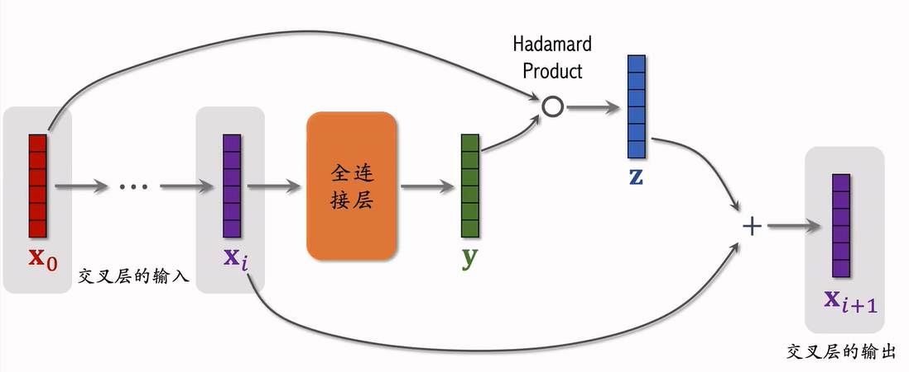

# 特征交叉

## 一、Factorized Machine(FM)因式分解机

### 线性模型

有d个特征$x=[x_1,\cdots,x_d]$，线性模型输出为$p=b+\sum^d_{i=1}w_ix_i$. 其中模型有d+1个参数，预测是特征的加权和。x是多维向量。

### 二阶交叉特征

线性模型没有计算特征之间的交互关系，即乘法。二阶交叉特征的输出为$p=b+\sum^d_{i=1}w_ix_i+\sum^d_{i=1}\sum^d_{j=i+1}u_{ij}x_ix_j$. 其中多加了不同特征之间的相乘项，u为上三角矩阵的权重。

u的矩阵大小是$d\times d$，为了减少参数量，可以对该矩阵进行分解。如下图，每个$u_{ij}$可以近似用$v_i^\top v_j$计算得到。

将这种模型记作FM，其参数量是$O(kd),k<<d$.
$$
p=b+\sum^d_{i=1}w_ix_i+\sum^d_{i=1}\sum^d_{j=i+1}(v_i^\top v_j)x_ix_j
$$

- FM是线性模型的替代品，线性部分后面加上交叉项，并用矩阵分解优化。
- FM使用二阶交叉特征，表达能力比线性模型更强。
- FM降低了参数数量。

> 是2010年的文章，但现在在业务中已经过时。

## 二、DCN

深度交叉网络(Deep & Cross Network, DCN)可以作为神经网络的一种用在召回和排序模型中。

### 交叉层(Cross Layer)

对于第i个交叉层，将其**输出**和**原始输入**做哈达玛乘积（对应位置元素相乘）得到z，将z和**该层输入**做加法得到输出。z和xi的相加就是残差链接。

### 交叉网络(Cross Network)

交叉网络即多个交叉层的连接，注意，参与交叉的只是最原始的输入x0.

### 深度交叉网络(Deep & Cross Network)

那么深度交叉网络就是CN和DNN的结合，如下图，特征连接后分别输入FC层和CN层，得到的两个输出**连接**，输入FC层得到最终输出。DCN可以作为召回和排序的神经网络中。

## 三、LHUC网络

Learning Hidden Unit Contributions(LHUC or PPnet)只能用在**精排**.

如下图，将用户特征和物品特征做哈达玛乘积，这种结构可以一直加深下去。物品特征的网络结构是一层FC，用户特征的则是多层FC组成的网络，最后是一个sigmoid函数*2，将输入激活层的值变换到0~2之间，实现对物品特征的加权，能放大某些特征，缩小另一些特征。

## 四、SENet和Bilinear Cross

### SENet

SENet是18年一个cv任务中提出，在推荐中也用到。

如下图，m个物品特征向量，每个向量维度为k。先对其做avgpool，取每个特征的均值。再经过两个FC+激活层的压缩和放大，得到mx1的向量，表示这m个特征的权重。将权重和对应特征相乘，得到重新加权后的向量矩阵。

SENet实际上是对离散特征做field-wize加权，用户的每个特征视作一个field。

> 在cv中每个feature map视作一个field。

### Bilinear

除了加权，也可以做field间特征交叉。field间的交叉是不同特征向量之间的交叉。

**特征交叉的方式**：

- 内积：两个特征向量的累乘求和，最后得到一个实数。m个特征会得到m*m个实数。
- 哈达玛积：两个特征向量对应位置相乘，得到一个k维向量。m个特征会得到m*m个k维向量。
- Bilinear Cross（内积）：在两个特征向量$x_i,x_j$的内积之间，添加一个矩阵W。交叉后的特征为$f_{ij}=x_i^\top \cdot W_{ij}\cdot x_j$. 最后得到一个实数，不要求两个向量形状一致。m个特征会得到m*m个参数矩阵。
- Bilinear Cross（哈达玛积）：将第一个内积替换为哈达玛积，$f_{ij}=x_i \odot (W_{ij}\cdot x_j)$. 最后得到一个k维向量，k是$x_i$的维度，矩阵相当于对$x_j$进行维度转换。m个特征会得到m*m个参数矩阵。

特征交叉的参数量很大，可以选取部分有意义的特征交叉。

### FiBiNet

SENet+Bilinear

如下图，对特征进行三种处理：直接连接，Bilinear交叉，SE后bilinear交叉/连接。三种处理的结果连接后输入网络。

