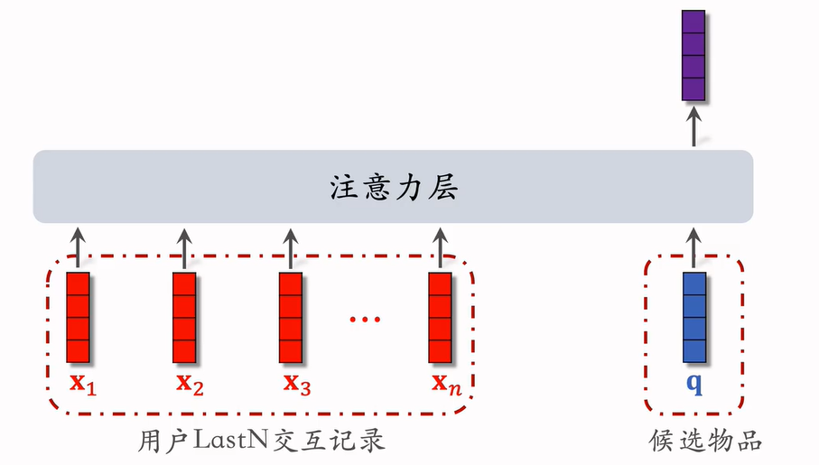
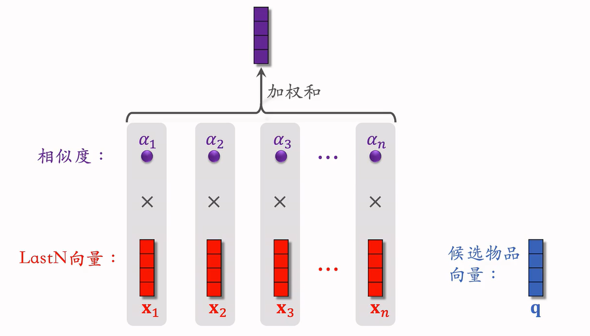

# 行为序列

## 一、用户历史行为序列建模

行为序列(last-n)：最近交互过的n个物品，是用户特征之一。

### last-n

交互：点击、点赞、收藏各求一次last-n，对n个物品属性做embedding。

- 获取用户最近交互过的n个物品ID(或类目等)
- 对n个ID(或类目等)做embedding，得到n个向量
- n个向量取平均(或者做attention)，作为用户特征之一。
  - 还有其它的特征，和last-n特征连接起来

## 二、DIN模型

在last-n个物品中，用加权平均（即attention）代替平均。

### 计算权重

对于每个**候选物品**的预测，需要计算其与用户历史交互的last-n物品相似度。两者embedding越相似则权重越高。

将n个物品embedding按照权重加权求和，即为用户历史行为序列。

### 缺点

注意力层的计算量正比于n，因此n只能在几百个以内。DIN只能关注用户的短期兴趣，遗忘长期兴趣。

### 对比DIN和平均

- 两者都适用于精排模型
- DIN需要额外物品特征，而简单平均只需要用户特征。
  - DIN不适用于双塔模型、三塔模型

## 三、SIM模型

利用用户的长期兴趣，n可以到几千。

### 原理

last-n中不全是和候选物品相似的，不相似的物品权重较低，可以直接删去。

### 查找

- Hard Search：根据规则筛选
  - 例如：根据候选物品的类目，保留last-n中相同类目的物品
  - 简单、快速、无需训练
- Soft Search：根据embedding做k近邻查找
  - 效果更好，但实现更复杂，计算代价更复杂

### 加权平均

对查找出的最相关的k个物品做DIN加权平均。

**时间信息**

SIM额外引入了last-k个物品的时间信息，即用户交互的时间。因为SIM考虑长期兴趣，因此这k个物品的时间跨度可能很长，而时间越长，重要性应该越低，不能一视同仁。

对**距今时间**做离散化，再做embedding，变成向量。连接到物品向量之后，将连接后的向量输入注意力层中。

