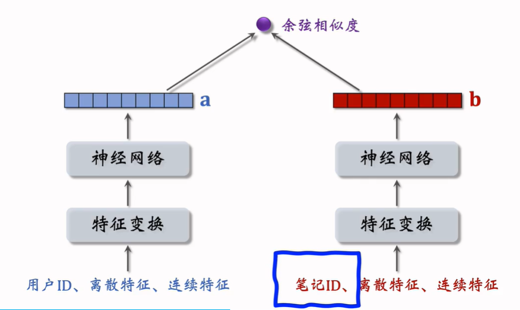

# 物品冷启动

## 一、优化目标，评价指标

- UGC，user generated content，用户自己上传的内容

- PGC，platform generated content，平台采购的内容

**新笔记需要启动**

新发布的笔记缺少和用户的交互，而让新笔记获得曝光能够促进用户积极性。

### 优化冷启动的目标

1. 精准推荐新笔记给合适的用户，不引起反感
2. 流量给新笔记倾斜，激励发布
3. 初期小流量的试探，挖掘高潜力的笔记，扶持成为热门

在全链路中都可以对针对冷启动问题进行优化，此外还可以通过流量调控的方法。

### 评价指标

- **作者侧指标**：—— 衡量作者发布积极性
  - 发布渗透率(penetration rate)：当日发布人数/日活人数
  - 人均发布量：当日发布笔记数/日活人数
- **用户侧指标**：
  - 新笔记的消费指标：点击率、交互率
    - 新笔记也有头部效应，少量头部新笔记占据了大量的曝光，这并不代表低曝光的就完全无效
    - 将高曝光、低曝光的笔记分开考察，给予新笔记额外的处理
  - 大盘消费指标：消费时长、日活、月活 —— 对新笔记的扶持不能影响大盘指标
- **内容侧指标**
  - 高热笔记占比：前30天获得1000+次点击的笔记（高热笔记）占比越高，冷启阶段挖掘内容的能力越强。

## 二、召回的优化

- 缺少用户交互，得到的ID embedding效果不好
- 缺少用户交互，ItemCF不适用

### 双塔模型的优化

双塔模型中id embedding非常重要，新笔记的id embedding还没有学好，放入双塔模型中效果不好。

**解决方案**

1. **default embedding**：在做id embedding的时候，让所有新笔记共享一个id，该id对应的embedding就是default embedding.
2. **利用相似笔记的embedding**：根据多模态网络得到的内容信息，找到和新笔记相似的k个高曝光（高曝光学的好）笔记的embedding，取平均作为它的。
3. **多个向量召回池**：1小时新笔记，6小时新笔记，30天笔记等。

### 类目/关键词召回

> 下面类目可以替换为关键词

**用户画像**：构建每个用户的画像，基于他感兴趣的类目、关键词等。

**类目索引**：每个类目建立其对该类目内笔记的索引，按时间顺序倒排。

**类目召回**：用户画像 -> 类目 -> 笔记列表中前k个笔记

**缺点**

1. 只对刚发布的笔记有效
2. 弱个性化，类目的范围太大

### 聚类召回

**聚类**：对笔记做聚类，将相似的笔记推给用户。

**聚类索引**：对每个新笔记映射成一个向量，找和哪个cluster更相近。cluster -> 笔记ID列表（时间顺序倒排）

**聚类召回**：对一个用户，找到last-n交互列表，找到n个笔记对应的cluster，每个取出m篇新笔记。

**缺点**

1. 只对刚发布的笔记有效

### Look-Alike召回

**look-alike**

一个商品可能有一批种子用户，需要寻找和他们相似的用户作为潜在用户投放广告。可以用UserCF，用户embedding相似度计算

**用于新笔记召回**

和新笔记有交互的用户记作种子用户，寻找和种子用户look-alike的用户推荐。

- 将种子用户的embedding取平均，这样每个新笔记对应一个目标用户向量
  - 每当有新用户交互该物品，更新特征向量
- 每当有用户刷小红书，用户塔计算其特征向量，对比和新笔记目标向量的距离，找到最近几十篇的新笔记推荐。

## 三、流量调控

- 在推荐结果中强行插入新笔记
- 对新笔记的排序分数提权（boost）
  - 在粗排和重排阶段挑选出新笔记，不让其被过滤掉
- 对新笔记做保量
  - 任何新笔记，都保证其有100次曝光机会
  - 在原有提权系数的基础上，乘以额外的提权系数
    - 提权系数=f(发布时间/目标时间，已有曝光/目标曝光)
  - **缺点**：保量成功率远小于100%，很多笔记做不到100次曝光
- 差异化保量
  - 普通笔记保证100次曝光，优质笔记150次
  - 用模型评价笔记的内容优质与否；根据作者历史笔记质量评价内容

## 四、冷启的AB测试

###  

